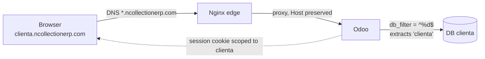

# Multi-Tenant DB Routing (ticket P1-T06)

How a request for `clienta.ncollectionerp.com` reaches **only** database `clienta`,
why the database selector is unreachable, and why a login on one tenant is worthless
on another. This is the platform's **routing backbone** (DELIVERABLE_1 §2.3–2.4,
ARCHITECTURE_SECURITY §5) — nothing ships until it is bulletproof.

## The flow



1. **DNS** — `*.ncollectionerp.com` → the VPS (wildcard A record).
2. **Nginx** (P1-T03) proxies to Odoo with the `Host` header preserved (`proxy_set_header Host $host`).
3. **Odoo** applies `db_filter = ^%d$`: `%d` = the **first hostname component** (`clienta`) → routes to database `clienta`.
4. **Session** cookies are database-scoped, so a `clienta` session is meaningless on `clientb`.

> **`%d` vs `%h` (a correction from planning v4.0):** in Odoo `%h` is the *full* hostname
> (`clienta.ncollectionerp.com`) and `%d` is the *first subdomain component* (`clienta`).
> Databases are named after the subdomain, so the correct filter is **`^%d$`**. `^%h$` would
> require a database literally named `clienta.ncollectionerp.com` and would break routing.

## Configuration

| Environment | `db_filter` | `list_db` | Where |
|---|---|---|---|
| **Prod** | `^%d$` | `False` | `config/odoo.prod.conf` (P1-T02), served by `docker-compose.prod.yml` |
| **Dev (default `make up`)** | *(off)* | `True` | permissive for everyday single-DB work |
| **Dev (routing proof)** | `^%d$` | `False` | opt-in `docker-compose.routing.yml` overlay (this ticket) |

The dev routing overlay only overrides Odoo's command
(`--db-filter=^%d$ --no-database-list --proxy-mode`); it **reuses the P1-T03 dev Nginx
block as-is** (`nginx/conf.d/ncollection.dev.conf`, `server_name .localhost`). Your normal
`make up` is unchanged.

## Verify it locally

```bash
make routing-up        # base + dev + routing overlay (db_filter ON, list_db OFF)
make routing-verify    # creates clienta/clientb/admin, runs the isolation proof
make routing-down      # stop the routing stack (keeps the test DBs)
make routing-clean     # drop the clienta/clientb/admin test DBs (destructive)
```

`make routing-verify` (`scripts/routing/verify_routing.sh`) needs **no sudo and no
`/etc/hosts`** — it reaches each subdomain with `curl --resolve <sub>.localhost:80:127.0.0.1`.
It proves four things and exits non-zero on any failure:

| # | Check | How |
|---|---|---|
| 1 | each subdomain reaches **only** its own DB | authenticates on `clienta.localhost`, confirms session DB = `clienta` **and** reads that DB's unique company marker (`CLIENTA CO`) |
| 2 | `db_filter` **rejects** a mismatched DB | `clienta.localhost` + `db=clientb` → no session granted |
| 3 | sessions are **DB-scoped** (no leak) | a `clienta` cookie is unauthenticated on `clientb` — and the reverse |
| 4 | the DB selector is **unreachable** | `/web/database/manager`, `/selector`, `/list` → `403` at the edge |

### Optional: browser testing with `/etc/hosts`

For a manual click-through (not required — the script needs neither), add these lines to
`/etc/hosts` (this needs `sudo`; the script never edits it for you):

```
127.0.0.1   clienta.localhost
127.0.0.1   clientb.localhost
127.0.0.1   admin.localhost
```

Then visit `http://clienta.localhost` — Odoo goes straight into the `clienta` database with
no selector.

## Troubleshooting

| Symptom | Likely cause | Fix |
|---|---|---|
| Any host shows the **database selector** | routing overlay not active (default dev keeps `list_db=True`) | `make routing-up` (adds `--no-database-list --db-filter=^%d$`) |
| `clienta.localhost` opens the **wrong / no** DB | `Host` not forwarded, or `db_filter` typo | confirm `docker inspect ncollection-odoo` shows `--db-filter=^%d$` (single `$`); Nginx must send `Host $host` |
| **502 Bad Gateway** | Nginx upstream wrong / Odoo down | check `docker compose ... ps`; the bus/HTTP upstream must point at `odoo:8069` in dev |
| **No live chat / notifications** | websocket routed to the wrong port | dev bus is on **8069** (workers=0); prod on **8072** (gevent) — see `nginx/README.md` |
| Login on `clienta` appears to work on `clientb` | **isolation breach** — stop and investigate | this must never happen; treat as a SEV1 (ARCHITECTURE_SECURITY §5) |
| `make routing-verify` can't reach the edge | routing stack not up | run `make routing-up` first |

## Public URL policy (ticket P1-T15)

White-labeling rule: **"odoo" must not appear in public-facing URLs** (naked domain,
login, password reset, portal, website). Implemented at the edge in
`nginx/snippets/public-urls.conf`, included by **both** the dev and prod server blocks.

### The decision boundary (accepted trade-off — do not "improve" this)

Odoo 19's JavaScript router **hardcodes** internal `/odoo/...` backend paths. Rewriting
them at the edge causes endless routing bugs on every upgrade. Therefore:

| Surface | Policy |
|---|---|
| Public entry `/` (no website module) | Odoo answers `303 → /odoo`; the edge rewrites that Location to **`/web`** (scoped `proxy_redirect` on `location = /` only) |
| `/web/login`, `/web/reset_password`, `/my` | already clean — no "odoo" in these URLs, nothing to do |
| **Backend `/odoo/...`** | **stays as-is** — internal, hardcoded by the JS router; accepted |
| `/web/login?redirect=/odoo` after deliberately visiting `/odoo` anonymously | accepted — the user typed the backend path themselves |

Flow effects of the `location = /` rewrite (all verified live on Odoo 19):
- **Anonymous prospect**: `/` → `/web` → `303 /web/login?redirect=%2Fweb%3F` — login page,
  **zero "odoo" in the whole chain**. ✅
- **Authenticated user**: `/` → `/web` → `200`, straight into the backend web client.
  (Why not `/web/login`? Odoo 19 does **not** bounce an authenticated visitor off the bare
  login page — it only redirects when a `?redirect=` param is present, and using
  `?redirect=/odoo` would leak "odoo" right back into the URL.)
- **Future website tenants**: with the website module installed, `/` returns `200` and the
  `proxy_redirect` is a **no-op**. The block is inert — do not remove it, do not "fix" it.

### Public aliases (301s)

Marketing-friendly short URLs owned by the edge (none exist as Odoo routes — verified 404
before claiming them):

| Alias | → Target |
|---|---|
| `/login` | `/web/login` |
| `/signup` | `/web/signup` |
| `/reset` | `/web/reset_password` |
| `/portal` | `/my` |

## Scope

This ticket is the **foundational, repeatable proof + the dev enablement + this document**.
The *automated* isolation test suite that runs on every PR (all 7 guarantees) is **P1-T20**;
the network port-scan / URL-probing security audit is **P1-T21**. Public URL rewriting
(hiding `odoo` from public URLs) is **P1-T15** — its policy and boundary are the section
above; it is pure Nginx infrastructure with **no OCA module** involved (Rule 2). Routing
itself is a **native Odoo feature** configured via `db_filter` — no OCA module (Rule 2).
