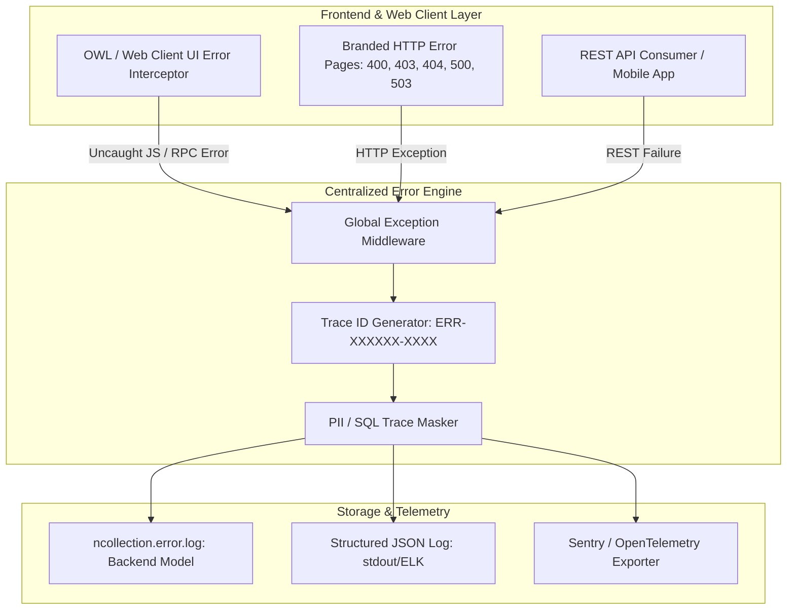

# NCollection ERP: Comprehensive Error Logging, UX Evaluation & Uniform Error UI Strategy

---

## 1. Executive Summary & Problem Analysis

In an enterprise SaaS ERP, how the system handles, logs, and presents errors is critical to:
1. **User Trust & UX**: Raw Python tracebacks or generic browser error screens cause confusion and anxiety.
2. **Supportability**: Support teams cannot debug customer issues without a **unique Correlation Trace ID (`ERR-...`)** linking the user's screen to backend logs.
3. **Security**: Default error modals often leak internal database table names, SQL queries, or file system paths to unprivileged users.

---

## 2. Current State Audit: What Logging Exists Today?

| Logging Subsystem | Current Implementation | Gaps & Deficiencies |
| :--- | :--- | :--- |
| **API Request Logging** | `ncollection.api.request.log` in `ncollection_api` | Tracks HTTP status, route, client, duration. Only logs REST API requests; does NOT capture web client RPC errors. |
| **Data Audit Trail** | `ncollection_audit` / `auditlog` | Captures CRUD modifications on data models; does NOT capture system crashes, 500s, or unhandled exceptions. |
| **Anomaly Engine** | `ncollection.anomaly.alert` in `ncollection_core` | Business invariant warnings (e.g. negative stock); not an operational error logger. |
| **Server Stdout/Stderr** | Python standard `logging.getLogger(__name__)` | Unstructured text output; impossible to correlate with frontend user sessions without manual timestamp hunting. |
| **Frontend Exception Logger** | None | Client-side JavaScript/OWL crashes are lost in user browser console and never reported to backend. |

---

## 3. UX Evaluation: Is the Current Error Experience Good?

### Verdict: **Suboptimal (C+)**

```
+-------------------------------------------------------------------------------+
| Flaw Area                | Current User Experience                            | Risk / Impact                                |
+--------------------------+----------------------------------------------------+----------------------------------------------+
| Web Client Modals        | Pops up technical "Odoo Server Error" dialog with  | Confuses business users, exposes internal    |
|                          | raw Python traceback frames.                       | model names and SQL structure.               |
| Frontend 404 / 403 Pages | Basic text with generic Odoo layout.               | Breaks brand immersion; lacks clear recovery |
|                          |                                                    | navigation.                                  |
| Frontend 500 Page        | Plain neutral page without brand CSS or recovery.  | User is stranded with no way back.           |
| Support Handoff          | No Error ID / Correlation Code displayed.          | Support asks user "what happened?" rather    |
|                          |                                                    | than looking up exact trace in logs.         |
+-------------------------------------------------------------------------------+
```

---

## 4. Architectural Blueprint: Enterprise Error Platform



---

## 5. Uniform Error UI Design System

For standalone HTTP error pages (`400`, `401`, `403`, `404`, `500`, `503`, `Workspace Suspended`), we introduce a **self-contained, zero-asset-dependent glassmorphic error template**:

### Visual & Interactive Elements:
1. **Dynamic Theme Sync**: Reads `--nc-primary` CSS custom property with default `#1F5F8F` fallback.
2. **Context-Aware Error State Visuals**:
   - **403 (Access Denied)**: Shield icon with clear permission explanation.
   - **404 (Page Not Found)**: Compass icon with direct navigation back to Dashboard.
   - **500 (Server Incident)**: Server alert icon with a **Copyable Incident ID badge** (`ERR-98A1F-442`).
   - **503 (Maintenance / Provisioning)**: Animated pulse loader with auto-retry status polling.
3. **One-Click Support Handoff**:
   - "Copy Error Code" button (copies `ERR-ID`, timestamp, tenant, and URL to clipboard).
   - "Return to Workspace" primary CTA.
   - "Contact Support" pre-filled email link (`mailto:support@ncollection.com?subject=Incident ERR-XXXXX`).

---

## 6. Implementation Deliverables Roadmap

1. **`ncollection_core/models/error_log.py`**:
   - Model `ncollection.error.log`: records `error_code`, `trace_id`, `user_id`, `url`, `http_status`, `error_type`, `message`, `traceback_masked`, `browser_agent`.
2. **`ncollection_branding/views/uniform_error_templates.xml`**:
   - Single unified master layout `ncollection_error_layout` with state variants for 400, 403, 404, 500, 503.
3. **`ncollection_core/controllers/error_handler.py`**:
   - Intercepts HTTP routing exceptions, generates unique `ERR-<UUID>` trace IDs, logs to `ncollection.error.log`, and renders uniform error template.
4. **OWL JavaScript Error Interceptor**:
   - Catches client-side errors and renders clean, friendly modal with "Copy Error ID" and "Reload Page" buttons, hiding raw stack traces behind an expandable "Advanced Details" accordion.
