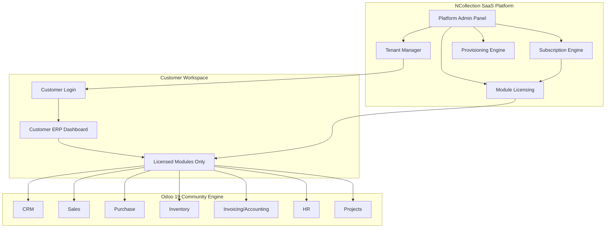

# NCollection ERP — Product Requirements Document (PRD)

> **Version**: 1.0  
> **Date**: July 14, 2026  
> **Status**: Draft — Pending Review  
> **Source**: Extracted from full project conversation history (451 messages, 228 user / 276 assistant turns)

---

## Table of Contents

1. [Executive Summary](#1-executive-summary)
2. [Project Vision & Objectives](#2-project-vision--objectives)
3. [Business Model & Target Market](#3-business-model--target-market)
4. [Product Architecture Overview](#4-product-architecture-overview)
5. [Two-Layer Architecture](#5-two-layer-architecture)
6. [Technical Stack & Infrastructure](#6-technical-stack--infrastructure)
7. [Custom Modules (NCollection Addons)](#7-custom-modules-ncollection-addons)
8. [OCA Community Modules](#8-oca-community-modules)
9. [ERP Module Inventory (Odoo 19 Community)](#9-erp-module-inventory-odoo-19-community)
10. [SaaS Platform Requirements](#10-saas-platform-requirements)
11. [Subscription Plans & Pricing Model](#11-subscription-plans--pricing-model)
12. [Multi-Tenant Architecture](#12-multi-tenant-architecture)
13. [Branding & White-Label System](#13-branding--white-label-system)
14. [UAE Localization Requirements](#14-uae-localization-requirements)
15. [Development Roadmap (8 Phases)](#15-development-roadmap-8-phases)
16. [Development Rules & Standards](#16-development-rules--standards)
17. [Current Project Status](#17-current-project-status)
18. [Team & Roles](#18-team--roles)
19. [Key Architectural Decisions Log](#19-key-architectural-decisions-log)
20. [Risks & Constraints](#20-risks--constraints)
21. [Acceptance Criteria](#21-acceptance-criteria)

---

## 1. Executive Summary

**NCollection ERP** is a SaaS ERP Platform built on top of **Odoo 19 Community Edition**. The platform targets small-to-medium businesses (5–100 employees) in the **UAE and GCC** region that cannot afford or do not want to contract with Odoo directly.

The project is **not** building an ERP from scratch. Instead, it leverages Odoo 19 Community as the business engine and builds a **SaaS platform layer** around it — including tenant management, subscription management, module licensing, branding/white-labeling, and UAE localization.

> [!IMPORTANT]
> **Key Insight from the Demo**: After presenting the initial demo to the client (who is the platform owner, not an end-user company), the team realized that the ERP functionality itself is already mature. **The missing piece is the SaaS experience** — tenant provisioning, subscription management, module visibility control, and the customer workspace. This shifted all priorities.

---

## 2. Project Vision & Objectives

### Vision
Build a subscription-based ERP platform — similar to Odoo's SaaS offering — that NCollection can sell to businesses in the UAE and GCC. Every subscribing company gets its own isolated workspace with only the modules they've paid for.

### Primary Objectives

| # | Objective | Priority |
|---|-----------|----------|
| 1 | Deliver a production-ready **Customer Workspace** where subscribers land directly in their ERP | **P0 — Immediate** |
| 2 | Build **Subscription & Tenant Management** so NCollection can provision new clients | **P0** |
| 3 | Implement **Module Visibility Control** tied to subscription plans | **P0** |
| 4 | Complete **NCollection Branding** (remove all Odoo references) | **P1** |
| 5 | Deliver **UAE Localization** (VAT 5%, AED currency, Arabic/English, invoice templates) | **P1** |
| 6 | Implement **Financial Reporting** via OCA modules (General Ledger, Trial Balance, P&L, Balance Sheet) | **P1** |
| 7 | Build **SaaS Automation** (auto-provisioning, billing, renewals, backups) | **P2** |
| 8 | Add **Executive Dashboards**, **AI Layer**, **Customer Portal**, and **Mobile** | **P3+** |

---

## 3. Business Model & Target Market

### Target Market
- **Geography**: United Arab Emirates (UAE) and GCC countries
- **Company Size**: 5–100 employees
- **Industries**: Trading, distribution, import/export, food industries, services, small manufacturing
- **Pain Points**: Cannot afford Odoo Enterprise; need Arabic/English support; need local VAT compliance; need quick onboarding

### Business Model: Subscription SaaS

```
NCollection (Platform Owner)
    │
    ├── Company A (Subscriber) → client-a.ncollectionerp.com
    ├── Company B (Subscriber) → client-b.ncollectionerp.com
    └── Company C (Subscriber) → client-c.ncollectionerp.com
```

### Revenue Streams

| Stream | Description |
|--------|-------------|
| **Monthly/Annual Subscriptions** | Tiered plans (Starter, Business, Enterprise) |
| **Implementation Fees** | Setup, configuration, data migration |
| **Customization Fees** | Client-specific module development |
| **Training** | User and admin training sessions |
| **Support** | Ongoing technical support packages |
| **Hosting** | Cloud infrastructure management |

---

## 4. Product Architecture Overview



---

## 5. Two-Layer Architecture

> [!IMPORTANT]
> **Development Rule #2**: Always think in two layers. Never mix responsibilities.

### Layer 1: Platform Layer (NCollection SaaS)

Everything related to running the **business of selling ERP**:

- Tenant provisioning & isolation
- Subscription plans & billing
- Module licensing & visibility
- Platform admin dashboard
- Customer onboarding
- Backup management
- Domain management

### Layer 2: ERP Layer (Odoo 19 Community)

Everything related to the **ERP functionality itself**:

- CRM, Sales, Purchase, Inventory
- Invoicing / Accounting
- HR, Projects
- Reports
- UAE Localization

---

## 6. Technical Stack & Infrastructure

### Software Stack

| Component | Technology | Notes |
|-----------|------------|-------|
| **ERP Engine** | Odoo 19 Community | Source code from GitHub, not Docker image (for full control during development) |
| **Database** | PostgreSQL 16 | Running in Docker container |
| **Containerization** | Docker + Docker Compose | Used from Day 1 for dev/staging/production parity |
| **Version Control** | Git + GitHub | Private repo: `NCollection-Sys/ncollection-erp` |
| **CI/CD** | GitHub Actions | Auto-build, test, deploy on push to `develop` |
| **DB Admin** | pgAdmin | Running in Docker for development |
| **Web Server** | Nginx | Reverse proxy (production) |
| **IDE** | VS Code | Extensions: Python, Docker, GitLens, XML, PostgreSQL |
| **OS (Dev)** | Windows 11 + WSL2 | Docker Desktop with WSL2 backend |
| **AI Assistant** | Claude (Antigravity) | Implementation partner — follows project rules |

### Infrastructure Architecture

```
Development (Local PC/Laptop)
    ↓ git push
GitHub Repository
    ↓ GitHub Actions CI/CD
Staging Server (Hetzner VPS)
    ↓ Manual promotion
Production Server
```

### Recommended Production VPS

| Provider | Specs | Purpose |
|----------|-------|---------|
| **Hetzner Cloud** | 4 vCPU, 8GB RAM, 80-160GB SSD, Ubuntu 24.04 | Development/Staging initially, Production later |

> [!WARNING]
> Shared hosting (e.g., Hostinger Shared) is **not suitable** for this project. Docker, PostgreSQL, and multi-tenant Odoo require a VPS or dedicated server.

### Project Directory Structure

```
D:\Projects\
├── odoo19/                    # Odoo 19 Community source (NOT modified)
│   └── (original Odoo code)
│
└── ncollection-erp/           # Our project repository
    ├── custom_addons/
    │   ├── ncollection_branding/
    │   ├── ncollection_subscription/
    │   ├── ncollection_tenant_manager/  (planned)
    │   ├── ncollection_uae/             (planned)
    │   ├── ncollection_saas/            (planned)
    │   └── ncollection_mis_templates/   (implemented)
    ├── config/
    ├── docs/
    ├── docker-compose.yml
    └── .gitignore
```

### Docker Compose Services

```yaml
services:
  db:        # PostgreSQL 16
  odoo:      # Odoo 19 (from source code during dev, image for production)
  pgadmin:   # Database management UI
  # nginx:   # To be added for production
  # redis:   # Optional, for caching
```

---

## 7. Custom Modules (NCollection Addons)

These are the **core intellectual property** of the NCollection platform.

### 7.1 `ncollection_branding` — White-Label Module

**Status**: ✅ Implemented (partial — pending items remain)

| Feature | Status |
|---------|--------|
| Replace Odoo logo with NCollection logo | ✅ Done |
| Custom Login page | ✅ Done |
| Custom Favicon | ✅ Done (needs polish) |
| Custom color scheme | ✅ Done |
| Remove Odoo references from UI | 🔲 Pending |
| URL branding (`/odoo` → custom) | 🔲 Pending |
| About dialog replacement | 🔲 Pending |
| Email template branding | 🔲 Pending |

---

### 7.2 `ncollection_subscription` — Subscription Management

**Status**: ✅ Implemented (core models, views, security, demo data — see DELIVERABLE_1 §1.2; business-logic enhancements tracked as P1-T07)

**Purpose**: Define and manage subscription plans that control what modules each tenant can access.

**Models**:
- `Subscription Plan` — Starter, Business, Enterprise (name, price, modules included, user limits)
- `Subscription` — Links a tenant/company to a plan with start/end dates, status
- `Module License` — Maps available Odoo modules to subscription tiers

**Key Features**:
- Create/edit subscription plans
- Activate/deactivate subscriptions
- Set expiration dates
- Choose which modules are enabled per plan
- Billing integration (future)
- Trial accounts support

---

### 7.3 `ncollection_tenant_manager` — Tenant Management

**Status**: ✅ Superseded — tenant management was implemented inside `ncollection_subscription` (the `ncollection.tenant` model); a separate module is no longer planned. Provisioning automation lives in `ncollection_saas` (Phase 2).

**Purpose**: Manage isolated customer environments.

**Key Features**:
- Create new tenant (company + database or company isolation)
- Assign subscription plan to tenant
- Suspend/resume tenant
- Delete tenant
- View tenant status and usage
- Tenant-level backup/restore

---

### 7.4 `ncollection_uae` — UAE Localization

**Status**: 🔲 Planned (Phase 3)

**Key Features**:
- UAE VAT (5%) configuration
- AED as default currency
- Multi-currency support
- Arabic/English bilingual interface
- UAE invoice templates
- UAE Chart of Accounts
- Local tax reporting formats
- Document formatting for GCC standards

---

### 7.5 `ncollection_saas` — SaaS Platform Administration

**Status**: 🔲 Planned (Phase 2)

**Purpose**: The administrative backend for NCollection platform operators.

**Key Features**:
- Customer management dashboard
- Plan management
- Subscription lifecycle management
- Module activation/deactivation per tenant
- License management
- Provisioning orchestration
- Domain management (subdomains per tenant)

---

### 7.6 `ncollection_mis_templates` — Financial Report Templates

**Status**: ✅ Implemented

**Purpose**: Custom MIS Builder templates providing:
- Balance Sheet
- Profit & Loss

Built on top of OCA's MIS Builder framework.

---

## 8. OCA Community Modules

The following OCA (Odoo Community Association) modules have been integrated:

### Installed OCA Modules

| Module | Source Repository | Purpose |
|--------|-------------------|---------|
| `account_financial_report` | OCA/account-financial-reporting (branch 19.0) | General Ledger, Trial Balance, Journal Ledger, VAT Report, Open Items, Aged Partner Balance |
| `mis_builder` | OCA/mis-builder | Framework for custom financial reports (Balance Sheet, P&L) |

### Planned OCA Modules (Post-MVP)

| Module | Repository | Purpose |
|--------|------------|---------|
| `account-financial-tools` | OCA/account-financial-tools | Advanced accounting utilities |
| `account-invoicing` | OCA/account-invoicing | Enhanced invoicing features |
| `account-payment` | OCA/account-payment | Payment processing extensions |

---

## 9. ERP Module Inventory (Odoo 19 Community)

### Available & Installed (Core ERP)

| Module | Status | Notes |
|--------|--------|-------|
| **CRM** | ✅ Installed | Leads, Opportunities, Customers |
| **Sales** | ✅ Installed | Quotations, Sales Orders |
| **Purchase** | ✅ Installed | RFQ, Purchase Orders, Vendors |
| **Inventory** | ✅ Installed | Multi-Warehouse, Stock Movements, Lots/Serial Numbers |
| **Invoicing** (`account`) | ✅ Installed | Customer Invoices, Vendor Bills, Journal Entries, Payments |
| **HR** | ✅ Installed | Employees, Departments, Contracts |
| **Projects** | ✅ Installed | Projects, Tasks, Kanban |
| **Manufacturing (MRP)** | Available | BOMs, Work Orders, Production Planning |
| **Maintenance** | Available | Maintenance Requests, Equipment |
| **Website Builder** | Available | Basic website builder |
| **E-Commerce** | Available | Basic online store |

### NOT Available in Community (Enterprise Only)

| Module | Alternative |
|--------|-------------|
| `account_accountant` (Full Accounting) | OCA Financial Reporting + MIS Builder |
| Payroll (official) | OCA Payroll modules |
| Documents Management | TBD |
| Helpdesk | TBD |
| Studio | N/A (custom development instead) |
| Advanced Dashboards | Custom dashboards planned (Phase 4) |
| Marketing Automation | Future phase |

---

## 10. SaaS Platform Requirements

### 10.1 Customer Workspace (Phase 1 — Highest Priority)

The customer experience flow:

```
Buy Subscription → Receive Tenant → Receive Credentials → Login
    → See only own company → See only licensed modules → Start using ERP
```

#### Epic 1: Customer Authentication
- Customer Login with email/password
- Forgot Password / Reset Password
- Session Management
- Remember Me
- Email Verification

#### Epic 2: Tenant Isolation (Critical)
Every customer must **only** access:
- Own company data
- Own users
- Own reports
- Own attachments
- Own API calls
- **Zero tenant leakage**

#### Epic 3: Workspace Experience
- After login, customer lands **directly in ERP**
- Customer should **never** see SaaS administration screens
- No visibility into: Organizations, Plans, Provisioning, Subscriptions, Module Manager, Platform Settings

#### Epic 4: Module Visibility
- Modules displayed according to subscription tier
- Automatic enforcement — no manual toggle per customer
- Example: Starter sees CRM + Sales + Invoices; Professional adds Inventory + Purchase; Enterprise sees everything

#### Epic 5: Customer Dashboard
- Completely different from SaaS admin dashboard
- Widgets: Sales, Receivables, Payables, Cash, Inventory, Tasks, Activities, Approvals, KPIs, Charts, Notifications, Quick Actions

#### Epic 6: Role Management (Per Tenant)
Pre-defined roles within each tenant:

| Role | Description |
|------|-------------|
| Owner | Full control, billing access |
| CEO | All modules, read-only financials |
| Manager | Department-level access |
| Sales | CRM, Sales, Invoicing |
| Warehouse | Inventory, Purchase |
| HR | HR module |
| Accountant | Accounting, Reports |
| Employee | Limited self-service |

#### Epic 7: Company Branding (Per Tenant)
Each subscribing company can configure:
- Logo, Primary/Secondary Colors
- Reports Logo, Invoice Logo, Portal Logo
- Favicon, Login Background
- Company Email, Company Website

---

## 11. Subscription Plans & Pricing Model

### Plan Tiers

| Plan | Modules Included | Target |
|------|------------------|--------|
| **Starter** | CRM, Sales, Invoicing | Freelancers, micro-businesses |
| **Business / Professional** | + Inventory, Purchase | Small trading/distribution companies |
| **Enterprise** | All modules + Custom Reports + E-Invoice + Accounting | Medium businesses needing full ERP |

### Pricing Model (TBD by NCollection)

- Monthly subscription (recurring revenue)
- Per-user pricing possible
- Annual discount option
- Trial accounts (time-limited)
- Implementation/setup fees separate

---

## 12. Multi-Tenant Architecture

### Chosen Model: Database-per-Tenant

```
client1.ncollectionerp.com → Database: client1_db
client2.ncollectionerp.com → Database: client2_db
client3.ncollectionerp.com → Database: client3_db
```

### Benefits
- **Complete data isolation** between tenants
- Independent backups per tenant
- Independent updates/migrations
- No risk of data leakage
- Easier compliance and auditing
- Follows the same model as Odoo.com

### How Odoo Supports This
- A single Odoo instance can serve multiple databases
- Users are routed to the correct database via subdomain
- Odoo's built-in `--db-filter` parameter enables this

---

## 13. Branding & White-Label System

### Goal
The end user (subscribing company) should **never** see any reference to Odoo. Everything should appear as **NCollection ERP**.

### Elements to Rebrand

| Element | Original | Target |
|---------|----------|--------|
| Login Page | Odoo logo + styling | NCollection logo + branding |
| Dashboard Header | "Odoo" | "NCollection ERP" |
| Favicon | Odoo icon | NCollection icon |
| Loading Screen | Odoo animation | NCollection animation |
| Email Templates | Odoo branding | NCollection branding |
| About Dialog | Odoo copyright | NCollection copyright |
| URL Paths | `/odoo/...` | `/app/...` or custom |
| PDF Reports | Odoo footer | NCollection footer |
| Error Pages | Odoo styling | NCollection styling |

### Legal Note
Using Odoo Community (LGPL) allows rebranding, but the team should review the specific license requirements for attribution in distribution contexts.

---

## 14. UAE Localization Requirements

| Requirement | Details |
|-------------|---------|
| **VAT** | 5% UAE VAT on applicable transactions |
| **Default Currency** | AED (UAE Dirham) |
| **Multi-Currency** | Support for USD, EUR, SAR, etc. with exchange rates |
| **Language** | Arabic + English (bilingual interface and reports) |
| **Invoice Templates** | Compliant with UAE commercial invoice standards |
| **Chart of Accounts** | UAE-standard chart of accounts |
| **Tax Reports** | VAT return reports in UAE format |
| **Document Formats** | GCC-standard commercial document formatting |
| **Electronic Invoicing** | Future — UAE e-invoicing compliance when mandated |

---

## 15. Development Roadmap (8 Phases)

### Phase 1: Customer Workspace ← **CURRENT PRIORITY**

> [!IMPORTANT]
> This is the foundation for every subsequent phase. Must be completed and stabilized first.

| Deliverable | Description |
|-------------|-------------|
| Customer Authentication | Login, forgot password, session management |
| Tenant Isolation | Data separation, access control |
| Workspace Landing | Direct ERP access post-login |
| Module Visibility | Subscription-based module display |
| Customer Dashboard | Business KPIs, charts, quick actions |
| Role Management | Per-tenant role definitions |
| Company Branding | Per-tenant logo/color customization |

---

### Phase 2: SaaS Automation

| Deliverable | Description |
|-------------|-------------|
| Auto-Provisioning | Create tenant + database automatically |
| Subscription Automation | Activate, renew, suspend, resume |
| Billing Engine | Invoice generation for subscriptions |
| Backup Management | Automated tenant backups |
| Domain Manager | Subdomain assignment per tenant |
| Email Automation | Welcome emails, renewal reminders |
| Scheduler & Queue | Background job processing |

---

### Phase 3: ERP Enhancement

| Deliverable | Description |
|-------------|-------------|
| CRM improvements | Enhanced lead management |
| Sales enhancements | Advanced quotation workflows |
| Purchase improvements | Approval workflows |
| Inventory enhancements | Advanced stock management |
| Accounting | Full OCA accounting stack |
| Projects improvements | Resource planning |
| HR enhancements | Attendance, leave management |
| Manufacturing | If market demands it |

---

### Phase 4: Executive Dashboards

| Dashboard | Target User |
|-----------|-------------|
| CEO Dashboard | Company executives |
| Finance Dashboard | CFO / Accountant |
| Sales Dashboard | Sales managers |
| HR Dashboard | HR managers |
| Warehouse Dashboard | Warehouse managers |
| Operations Dashboard | COO |

---

### Phase 5: AI Layer

| Feature | Description |
|---------|-------------|
| ERP Assistant | AI-powered chat within ERP |
| Smart Search | Natural language search across modules |
| Report Generator | AI-generated reports from natural language |
| Forecasting | Sales/inventory/cash flow predictions |
| Recommendations | AI-driven business recommendations |
| AI Insights | Automated anomaly detection |

---

### Phase 6: Customer Portal

| Feature | Description |
|---------|-------------|
| Invoice Portal | Customers view/pay invoices |
| Order Tracking | Track order status |
| Payment Gateway | Online payments |
| Support Tickets | Submit and track support requests |
| Knowledge Base | Self-service documentation |

---

### Phase 7: Mobile

| Feature | Description |
|---------|-------------|
| PWA | Progressive Web App |
| Android App | Native Android |
| iOS App | Native iOS |
| Barcode Scanning | Warehouse operations |
| Push Notifications | Real-time alerts |
| Offline Mode | Work without connectivity |

---

### Phase 8: Platform Services

| Feature | Description |
|---------|-------------|
| Audit Trail | Complete activity logging |
| Monitoring | System health and performance |
| Public API | REST API for integrations |
| Webhooks | Event-driven integrations |
| Marketplace | Third-party addon marketplace |
| Developer SDK | Tools for addon developers |

---

## 16. Development Rules & Standards

> [!CAUTION]
> These rules must **always** be respected. Violations create technical debt that compounds over time.

### Rule 1: Never Modify Odoo Core
Always prefer:
- Custom Addons in `custom_addons/`
- Python class inheritance (`_inherit`)
- OWL component patching
- CSS overrides
- XML view inheritance

### Rule 2: Two-Layer Thinking
- **Platform Layer** — SaaS, tenants, subscriptions
- **ERP Layer** — Business modules, reports, workflows
- Never mix responsibilities between layers

### Rule 3: Milestone-Driven Development
- Every feature belongs to one milestone
- No random/ad-hoc development
- Everything follows the roadmap

### Rule 4: Design Before Code
Before writing code, always define:
1. Business Goal
2. User Flow
3. Models (database)
4. Views (UI)
5. Permissions (access rules)
6. Acceptance Criteria

### Rule 5: Maintain Upgrade Compatibility
- No hacks or fragile overrides
- No breaking changes
- Must be able to upgrade Odoo version without rewriting custom modules

### Rule 6: Odoo Source Code Separation
```
odoo19/          ← Original code, NEVER modified
ncollection-erp/ ← Our repository, all changes here
```

---

## 17. Current Project Status

### Completed ✅

| Item | Details |
|------|---------|
| Environment Setup | Docker, PostgreSQL 16, Odoo 19, pgAdmin |
| GitHub Repository | `NCollection-Sys/ncollection-erp` connected |
| Docker Compose | Working `docker-compose.yml` for dev |
| Branding (Partial) | `ncollection_branding` — Logo, login page, favicon, colors |
| Demo Data | "Fresh Origin" demo company with CRM, Sales, Purchase, Inventory, HR, Projects data |
| OCA Financial Reporting | `account_financial_report` installed (General Ledger, Trial Balance, Journal Ledger, VAT Report, Open Items, Aged Partner Balance) |
| MIS Builder | Installed with custom `ncollection_mis_templates` (Balance Sheet, P&L) |
| Client Demo | Successfully presented to NCollection client |

### In Progress 🔲

| Item | Status |
|------|--------|
| Complete Branding | URL paths, About dialog, email templates pending |
| Customer Workspace | **Next sprint** — Phase 1 |

### Not Started ⬜

| Item | Phase |
|------|-------|
| UAE Localization | Phase 3 |
| SaaS Automation | Phase 2 |
| Executive Dashboards | Phase 4 |
| AI Features | Phase 5 |
| Customer Portal | Phase 6 |
| Mobile Apps | Phase 7 |

---

## 18. Team & Roles

| Member | Role | Responsibilities |
|--------|------|-----------------|
| **Omar** | Project Owner / Lead Developer | Architecture decisions, client communication, development |
| **Claude / Antigravity** | AI Implementation Partner | Module development, code implementation, follows project rules |
| **NCollection Client** | Platform Owner / Business Stakeholder | Defines business requirements, approves milestones, will operate the SaaS platform |

### Claude/AI Collaboration Rules
- Understand the current milestone before coding
- Verify architecture alignment
- Avoid regressions
- Maintain Odoo 19 Community compatibility
- Build features incrementally
- **Do not jump to future phases** until the current milestone is complete

---

## 19. Key Architectural Decisions Log

| # | Decision | Rationale | Date |
|---|----------|-----------|------|
| 1 | **Build on Odoo 19 Community**, not from scratch | 15+ years of ERP maturity; faster time-to-market by orders of magnitude | Day 1 |
| 2 | **Odoo 19** (not 18) | Newer UI/UX; longer support lifecycle; starting fresh with no legacy modules | Day 1 |
| 3 | **SaaS model** (not on-premise) | Recurring revenue; centralized management; scalable | Day 1 |
| 4 | **Remove all Odoo branding** | Platform must appear as NCollection's own product | Day 1 |
| 5 | **UAE/GCC market** (not Egypt) | Client's target market; changes localization priorities entirely | Day 1 |
| 6 | **Database-per-tenant** (not multi-company) | True isolation; independent backups; follows Odoo.com's model | Day 1 |
| 7 | **Docker from Day 1** | Dev/prod parity; reproducible environments; easy deployment | Day 1 |
| 8 | **Never modify Odoo Core** | Maintainability; upgrade compatibility; all changes via custom addons | Day 1 |
| 9 | **Source code** during dev (not Docker image) | Full control over Odoo internals during development | Week 1 |
| 10 | **OCA Financial Reporting** over building custom | Community-maintained; battle-tested; Odoo 19 branch available | Week 1 |
| 11 | **MIS Builder** for Balance Sheet / P&L | Flexible report builder; works with Community; custom templates | Week 1 |
| 12 | **Customer Workspace = #1 priority** (post-demo shift) | ERP is mature; the SaaS experience is what's missing | Post-demo |
| 13 | **Hetzner Cloud** for VPS hosting | Cost-effective; good performance; EU-based; suitable for initial deployment | Planned |
| 14 | **GitHub Actions** for CI/CD | Integrated with repository; auto-deploy on push to `develop` | Planned |

---

## 20. Risks & Constraints

### Technical Risks

| Risk | Impact | Mitigation |
|------|--------|------------|
| OCA module incompatibility with Odoo 19 | Accounting features may break | Always check branch availability; test before installing |
| Odoo 19 is relatively new | Fewer community resources/examples | Accept trade-off for better UI/UX |
| Multi-tenant isolation complexity | Data leakage between tenants | Use database-per-tenant; thorough security testing |
| Performance at scale (many tenants) | Slow response times | Plan for horizontal scaling; monitor early |

### Business Risks

| Risk | Impact | Mitigation |
|------|--------|------------|
| Odoo license compliance | Legal issues | Review LGPL terms; maintain attribution where required |
| Competition from Odoo.com directly | Market pressure | Differentiate via UAE localization, Arabic support, local pricing, local support |
| Client expectations vs. development speed | Scope creep | Strict phase-based development; no jumping ahead |

### Known Unresolved Issues

- Full Accounting (`account_accountant`) is Enterprise-only — using OCA stack as alternative
- `ncollection_branding` still has pending items (URL paths, About dialog, email templates)
- Shared hosting (Hostinger) cannot be used for production — VPS needed
- Some OCA modules may need manual compatibility patches for Odoo 19

---

## 21. Acceptance Criteria

### Phase 1 (Customer Workspace) — Definition of Done

A subscribing company's experience must satisfy **all** of the following:

- [ ] Company receives a provisioned tenant (even if manually created initially)
- [ ] Company users can log in via `company.ncollectionerp.com`
- [ ] Users land directly in their ERP workspace (not a SaaS admin panel)
- [ ] Users see **only** their licensed modules (based on subscription plan)
- [ ] Users **cannot** access any SaaS administration screens
- [ ] Users **cannot** see or access any other tenant's data
- [ ] Basic role-based access control works within the tenant
- [ ] Tenant can customize their own logo and company information
- [ ] All visible branding says "NCollection ERP" — no Odoo references

---

> [!NOTE]
> This PRD should be treated as a **living document**. It must be updated after each sprint to reflect new decisions, completed milestones, and evolving requirements. It serves as the **single source of truth** for the NCollection ERP project — replacing scattered chat history and ad-hoc notes.
