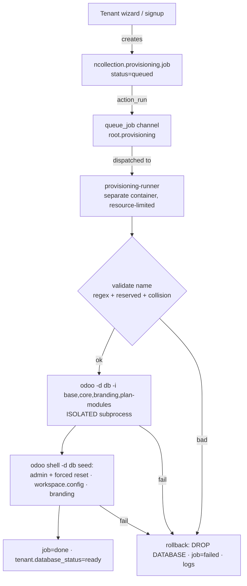

# Tenant Provisioning Engine (ticket P2-T01)

Turns a queued `ncollection.provisioning.job` into a **login-ready tenant database**,
or rolls back cleanly — running in a **resource-isolated satellite** so heavy tenant
creation never shares a process with the HTTP workers serving live tenants
(ARCHITECTURE_DATA_PLATFORM §10, ARCHITECTURE_SECURITY §11).

## Flow



## Isolation (the point of P2-T01)

- **Off the HTTP workers:** `action_run` enqueues via OCA `queue_job` (`.with_delay`,
  channel `root.provisioning`); the **`provisioning-runner`** container
  (`docker-compose.saas.yml`) runs the jobrunner with `mem_limit`/`cpus` caps.
- **No cross-DB ORM (Rule 3):** the admin process NEVER opens a cursor on a tenant DB.
  Tenant DBs are created + seeded through isolated `odoo` **subprocesses**; rollback drops
  them via a direct `psycopg2` maintenance connection.
- **Direct DB connection:** the runner connects straight to PostgreSQL (never through a
  pooler — `queue_job` relies on `LISTEN/NOTIFY`).

## Security (SECURITY §11 — enforced + tested)

| Threat | Mitigation |
|---|---|
| DB-name injection | strict regex `^[a-z][a-z0-9_]{2,62}$`; the name is a subprocess arg, never shell-interpolated |
| Tenant overwrite | collision check (`pg_database`) before any side effect |
| Reserved names | rejected: `admin, www, staging, api, postgres, template0, template1` |
| Resource exhaustion / DoS | per-hour quota (`ncollection_saas.provisioning_quota_per_hour`, default 20; `0` disables) |
| Half-provisioned zombie | any failure drops the DB (`DROP DATABASE … WITH (FORCE)`); job → `failed` with logs |
| Weak initial creds | tenant admin seeded with a **forced password reset** (no known password) |

## Running it

```bash
# Opt-in runner (async, prod-shaped). Not started by `make up` or CI.
docker compose -f docker-compose.yml -f docker-compose.dev.yml \
               -f docker-compose.saas.yml up -d provisioning-runner
```

Or, **without any container**, trigger the engine inline from the job form
("Provision (inline)") or `job.action_run_sync()` — same engine, no queue. This is how
provisioning is developed and tested locally.

## Verification / test split

- **CI (`tests/test_provisioning.py`, 14 tests):** the pure logic — name sanitisation,
  reserved words, collision, module set, quota, status transitions, enqueue. No subprocesses.
- **Local (`scripts/provisioning/verify_provisioning.sh`):** the real end-to-end —
  `PLATFORM_DB=<db> bash …/verify_provisioning.sh` provisions a live tenant DB (modules
  installed, workspace.config written, admin seeded) **and** proves rollback drops a
  half-built DB. This spawns real `odoo` subprocesses, so it runs locally, not in CI
  (same split as P1-T06's routing proof). Latest local run: **7/7 passed**.

## OCA decision (Rule 2)

The async runner is **OCA `queue_job`** (pinned in `repos.yml` — see `OCA_DEPENDENCIES.md`
for the `ebb87ea4` pin rationale). The engine itself (validate/create/seed/rollback) is
platform-specific and lives in `ncollection_saas`.

## Scope / next

This is the **engine core**. The public signup pipeline that *calls* it is **P2-T02**;
the config-sync channel that keeps `workspace.config` fresh is **P2-T03**; per-tenant
domain/SSL is **P2-T06**.
