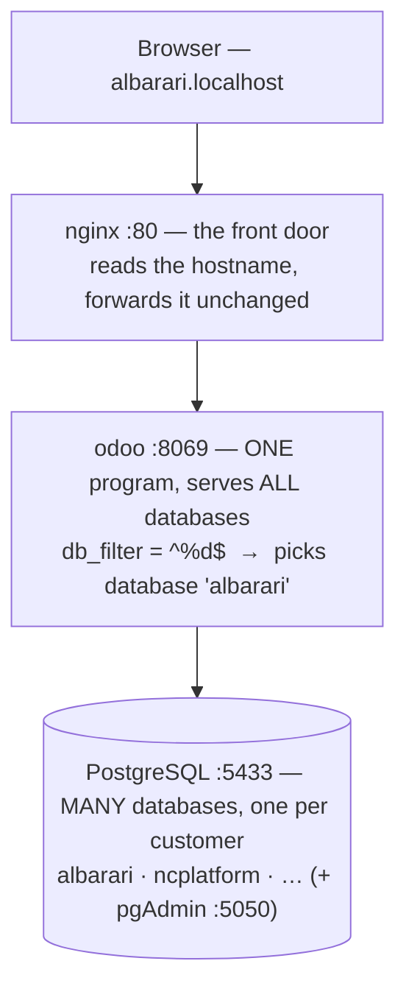
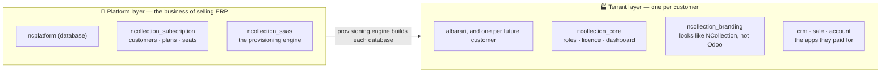
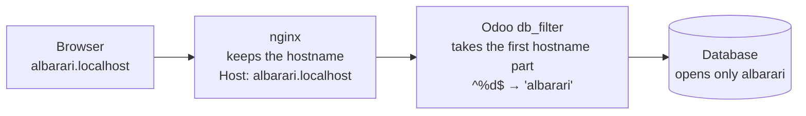

# How the System Works

> Plain-language onboarding primer. A print-formatted version lives at
> [`docs/pdf/SYSTEM_EXPLAINED.pdf`](../pdf/SYSTEM_EXPLAINED.pdf).

**The whole thing in one sentence:** one Odoo program serves many separate
databases, and each customer company gets its own database. Everything else —
nginx, the SaaS layer, the branding, the licensing — is machinery that makes
that single idea **safe**, **sellable**, and **branded**.

---

## 1 · The vocabulary that trips people up

These words get used loosely everywhere. Here is exactly what each means in *this* system:

| Word | What it really is | Concrete example |
|---|---|---|
| **You / NCollection** | The SaaS vendor. You own the platform and sell subscriptions. | — |
| **Customer** = **Tenant** | A *company* that buys a subscription. **One customer = one database.** | Al Barari Trading → database `albarari` |
| **Employee** = **User** | A *person* who works at that company — a `res.users` row *inside* that company's database. | Fatima Rahmani → `fatima@albarari.ae` |
| **Plan** | What the customer bought. Decides which apps they may use. | `DEMO` plan → `crm, sale, account` |
| **Role** | What one employee may do *inside* their company. | Fatima = Accountant |

> **Read this twice.** *Customer* and *tenant* are the same thing — "customer" is
> the business word, "tenant" is the technical word. And a **customer is a
> database**, while an **employee is a row inside it**. That single distinction
> clears up most of the confusion.

---

## 2 · What is physically running

Four Docker containers. The one crucial fact: **there is only one Odoo process.**
It does *not* run a copy per customer — it looks at who is asking and opens the
right database.

---

## 3 · The two layers — the core idea

Your databases split into two completely different *kinds*. Getting this split is
the key to understanding everything else.

- **Platform layer** (`ncplatform`) is **your** admin system — it sells and builds workspaces.
- **Tenant layer** (`albarari`, …) *is* the workspace — one database per customer.

> **The hard rule (Standing Rule 3).** The platform layer must **never** reach
> directly into a tenant database. When `ncollection_saas` builds `albarari`, it
> launches a *separate Odoo subprocess* rather than reaching across. This is why
> one customer's data can never leak into another's, even by a programming mistake.

---

## 4 · How a request finds the right customer

You visit `albarari.localhost`. The routing is one small trick repeated reliably:

**The subdomain *is* the database name.** That is the entire routing mechanism.
Two consequences fall straight out of it:

- **Database names must be plain letters/numbers.** `db_filter` matches the
  hostname to the database name literally — which is why the routing fixtures had
  to be `rtclienta`, not `rt-clienta`.
- **Sessions are database-scoped.** Logging into `albarari` gives a cookie that is
  meaningless on any other tenant. `make routing-verify` proves this eight ways.

---

## 5 · Licensing — two rings, not one

Al Barari bought `crm, sale, account`. Suppose they had *not* bought `sale`. Two
independent mechanisms enforce that:

| Ring | Where | What it does |
|---|---|---|
| **Ring 1 — cosmetic** (P1-T09) | `ir_ui_menu.py` | The Sales menu simply does not appear in the interface. |
| **Ring 2 — actual security** (P1-T10) | `license_enforcement.py` | Reading `sale.order` raises **AccessError** at the database layer, no matter how you ask. |

> **Why two?** Ring 1 alone would be worthless — anyone could type a URL and reach
> the data. **Hiding a menu is not security.** Ring 2 is what actually stops them.
> You can see this live: `e2eclientb` has `sale` *installed but not licensed*, and
> reading `sale.order` returns *"The 'sale.order' feature is not included in your
> NCollection plan."*

---

## 6 · Roles — what one employee may do

Inside every tenant there are **8 roles**: Owner, CEO, Manager, Sales, Warehouse,
HR, Accountant, Employee. Each role does **two separate things**, and it matters
that they are separate:

| A role grants… | …which means |
|---|---|
| **Odoo access** (an app group) | Accountant → `account.group_account_user` → can actually open Accounting |
| **Dashboard widgets** (a widget group) | Accountant → the `financial` widget group → sees receivables, payables, cash |

That is why the demo looks different per login: Fatima (Accountant) sees
receivables and cash; Yousef (Sales) sees the pipeline; Aisha (Employee) sees only
her own activities. The gating is enforced **server-side** — a widget a role may
not see is absent from the data sent to the browser, not merely hidden.

---

## 7 · Your databases, decoded

This is the table that would have saved the "everything is broken" scare:

| Database | What it is |
|---|---|
| `ncplatform` | Your SaaS control plane — where customers and plans live |
| `albarari` | A real customer workspace (Al Barari Trading) — **the one worth looking at** |
| `ncollection` | Your personal dev sandbox |
| `rtclienta` / `rtclientb` / `rtadmin` | Routing test fixtures — `base` only, empty **by design** |
| `e2eclienta` / `e2eclientb` / `e2eadmin` | Automated-test fixtures — rebuilt constantly |
| `postgres` | PostgreSQL's own bookkeeping database |

> **This is exactly what misled us once.** Someone logged into `clienta` — a
> *routing test artifact* holding nothing but Odoo's skeleton — and reasonably
> concluded the product was broken. It was never a workspace. That is precisely
> why those fixtures were renamed to the obvious `rt*` prefix.

---

## 8 · Signup, end to end

1. Someone signs up → a record is created in `ncplatform` (the platform layer).
2. The **provisioning engine** creates a new database, e.g. `theircompany`.
3. It installs `ncollection_core` + `ncollection_branding` + whatever apps their plan licensed.
4. It writes their plan into `workspace.config` — the record that drives licence enforcement.
5. They visit `theircompany.ncollectionerp.com` → `db_filter` routes them → their own isolated world.

The `albarari` demo tenant (`make demo-tenant`) was built through exactly this path.

---

## 9 · The mental model, compressed

> **Odoo** is the engine. **nginx** is the doorman who reads the nameplate.
> **PostgreSQL** holds one sealed room per customer. **`ncplatform`** is your front
> office that sells rooms and builds them. **`ncollection_core`** is what makes each
> room *yours* rather than generic Odoo — the roles, the licensing, the dashboard.
> An **employee** is a person inside one room, who can never see into another.

---

## Appendix · Why empty data hides bugs

An early report that "the platform is fundamentally broken" turned out to be false
— every tenant returned a normal page with no errors. But taking it seriously
surfaced three genuine defects, all invisible for the same reason: *nothing in the
system had data in it.*

| Defect | Why it hid | Ledger |
|---|---|---|
| Branding not loading | one easily-missed ERROR line; Odoo never retroactively installs a *newly-declared* dependency into an *existing* database | R-012 |
| Cash & Bank always 0 | summed bank/cash *journal* lines, which always balance to zero; the right measure is the cash/bank *account* balance | R-013 |
| Provisioned roles grant no access | roles granted dashboard widgets but not the underlying Odoo app access, so an Accountant landed on an empty dashboard | R-014 |

> **The lesson worth keeping (R-013): a KPI that reads 0 on empty data is not
> evidence that it works.** An empty tenant returns the same harmless-looking 0
> whether the code is right or wrong, so all three bugs slipped past review, unit
> tests and CI. Widgets are only meaningfully verified against a *populated*
> tenant — which is what `make demo-tenant` now provides. See
> [`REGRESSIONS.md`](REGRESSIONS.md) for the full ledger.

---

### About this document

The Markdown above is the editable source (diagrams are Mermaid, so GitHub renders
them inline). The companion `docs/pdf/SYSTEM_EXPLAINED.pdf` is a print-formatted
render using the house stylesheet `docs/pdf-style.css`; its diagrams are drawn in
print CSS rather than Mermaid, but the content is the same.
