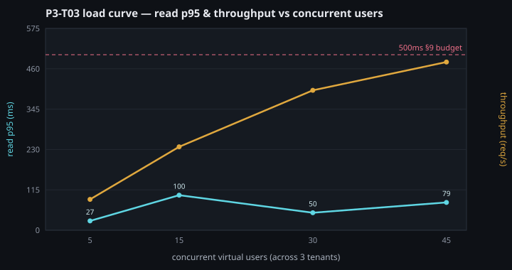

# P3-T03 — Odoo Worker Tuning & Load-Test Baseline

Evidence for **[P3-T03] Odoo Worker Tuning & Load Testing**. The load harness
([`scripts/perf/load_test.js`](../../scripts/perf/load_test.js) +
[`run_load_test.sh`](../../scripts/perf/run_load_test.sh)) is committed and
parameterised for both this dev-box baseline and the full staging run.

## Method

`run_load_test.sh` brings up the **production routing model** (`db_filter=^%d$`,
Host-based tenant selection — the P1-T06 topology), seeds a dedicated
`loadtest{a,b,c}` fixture set (own namespace, admin/admin, created once), and
drives **k6** (official `grafana/k6` container — no host install) across all
three tenants. Each VU logs in once, then repeatedly issues a **res.partner
`web_search_read`** — the query behind every list view — asserted against the
§9 interactive budget (p95 < 500ms). The runner sweeps VU levels and records a
load curve, then restores the base dev stack.

```bash
make load-test              # sweep 5/15/30/45 VUs across loadtesta/b/c
make load-test-clean        # drop the loadtest* fixtures
# staging (real target): point TARGETS at 3 real tenants, VU_SWEEP="50"
```

## Results

| Context | Value |
|---|---|
| Date | 2026-07-25 |
| Host | MacBook Air M1, 8 vCPU / **8 GB** (Docker Desktop) — a **dev** box |
| Odoo | dev stack, **threaded** mode (`workers=0`), tuned PostgreSQL (P3-T02) |
| Tenants | 3 (`loadtesta/b/c`), Host-routed under `db_filter=^%d$` |
| Read | `res.partner.web_search_read` (limit 80) |



| Concurrent VUs (÷3 tenants) | read p95 | throughput | errors | checks |
|---:|---:|---:|---:|---:|
| 5  | 27 ms  | 4.8 req/s  | **0%** | 100% |
| 15 | 100 ms | 13.0 req/s | **0%** | 100% |
| 30 | 50 ms  | 21.8 req/s | **0%** | 100% |
| 45 | 79 ms  | 26.2 req/s | **0%** | 100% |

Every read is validated at the application layer (`status 200 && no JSON-RPC
error`, with a `checks: rate>0.99` k6 threshold) — so 100% checks means the reads
genuinely returned partner data, not HTTP-200 error envelopes.

## Interpretation

- **Comfortably inside the §9 budget:** read **p95 stayed under ~100 ms at every
  level up to 45 concurrent authenticated users across 3 tenants, with 0 errors and
  100% valid responses** — well below the 500 ms interactive budget, even on an
  8 GB dev box in threaded mode. Login (once per VU) is the expensive op (~1.3 s);
  the interactive reads that dominate real usage are cheap on the P3-T02-tuned PG.
- **Throughput still climbing at 45 VUs:** RPS rises ~linearly 4.8→13.0→21.8→26.2 —
  the box is **not yet saturated** with these light indexed reads, so the knee is
  past 45 VUs on this hardware. The p95 wobble (27/100/50/79 ms) is short-run
  (20 s/level) variance on a shared laptop, not a trend.
- **What this proves / what it doesn't:** it proves the **request path + tuned PG +
  Host routing hold up under real concurrent load** with correct sessions. Threaded
  dev mode is not the prod worker (multiprocess) model, so the absolute
  worker-scaling numbers belong to the staging box — the same harness drives it
  unchanged (`VU_SWEEP="50"`, `TARGETS` = 3 real tenants).

## Worker tuning (config/odoo.prod.conf)

Odoo runs one OS process per HTTP worker; sizing is the **min of a CPU rule and a
memory budget**:

```
workers   = min( 2·vCPU + 1 ,  RAM_for_odoo / limit_memory_hard )
```

For the 50-tenant target box (**CX52, 16 vCPU / 32 GB**), with PostgreSQL taking
~8 GB (P3-T02) and ~2 GB for the OS + PgBouncer + the queue runner:

- CPU rule → `2·16 + 1 = 33`
- Memory budget → `~22 GB / 2.68 GB ≈ 8`  ← **binding constraint**

So the box tops out near **6–8 HTTP workers**. The shipped value stays a
**conservative `workers = 4`** (safe on a smaller CX42/16 GB box too) and is
raised toward 6–8 only once P2-T10 monitoring confirms CPU headroom and RAM
ceiling under real load — over-provisioning workers just multiplies memory
pressure for no throughput if the box is memory-bound. `cron`/`queue` isolation
is already handled by the pooling split (P2-T09: `odoo-bus` runs cron direct,
HTTP workers go through PgBouncer with `max-cron-threads=0`).

`limit_time_real = 1200` (20 min) already caps request wall-time, which is the
safe per-request guard against a runaway interactive query. A blanket
PostgreSQL `statement_timeout` is **deliberately not set globally** (it would
also kill legitimate long operations — module installs, big reports, PITR
maintenance); the correct noisy-neighbor cap is a **per-role** `statement_timeout`
on the interactive DB role only, excluding the provisioning/maintenance role —
tracked as a hardening follow-up rather than a blind global default.

## Scaling thresholds (when to add RAM / workers / a second node)

From [ARCHITECTURE_DATA_PLATFORM §8](../markdown/ARCHITECTURE_DATA_PLATFORM.md)
exit signals, made concrete:

| Signal | Threshold | Action |
|---|---|---|
| Interactive p95 | creeping toward **500 ms** under normal load | add workers (if CPU-bound) or RAM (if memory-bound) |
| PgBouncer pool | saturation on `SHOW POOLS` (P2-T10 alert) | raise pool size / add RAM; then a second Odoo node |
| RAM | single-node ceiling reached (workers × `limit_memory_hard` + PG + OS) | **vertically scale RAM first** (workers & `shared_buffers` are the pressure points) |
| CPU | sustained > 60% | add workers up to the memory budget, then a second node (§4.3 horizontal split, tenants sharded across nodes) |

## Security notes

- **Fixtures use a dev-only `admin/admin`** (identical to the routing/e2e suites),
  written *only* to the isolated `loadtest*` DBs and only at creation. Run
  **`make load-test-clean`** at the end of a session — like the routing/e2e
  fixtures, they persist in the Postgres volume until dropped.
- **Staging run — do NOT pass real tenant credentials inline.** The `TARGETS`
  env lands in shell history and is visible via `ps`/`docker inspect`. For the
  real staging run, supply credentials via a `0600` `--env-file` or a mounted
  read-only secret file, and rotate the tenant admin password afterwards.

## Not covered

- The **real 50-user × 3-tenant staging run** — no staging server exists yet; the
  harness drives it unchanged when it does (`VU_SWEEP="50"`, real `TARGETS`).
- Prometheus/Grafana dashboards (P8-T04) — this ships a repeatable CLI baseline.
- Per-role `statement_timeout` noisy-neighbor cap — hardening follow-up (above).
